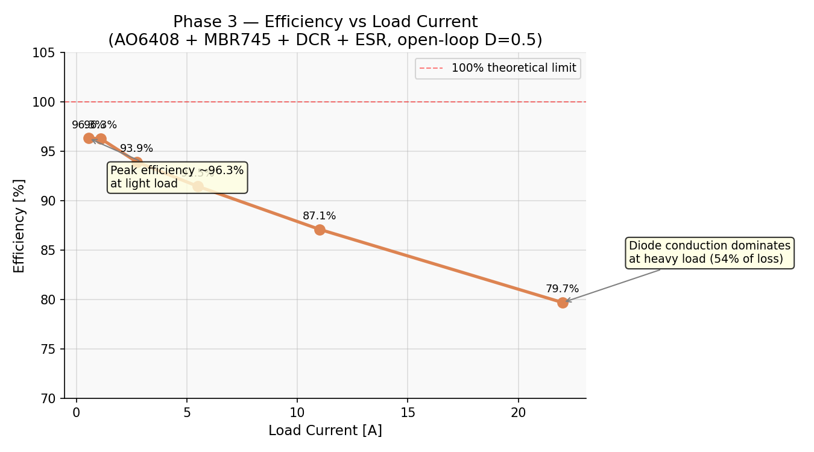
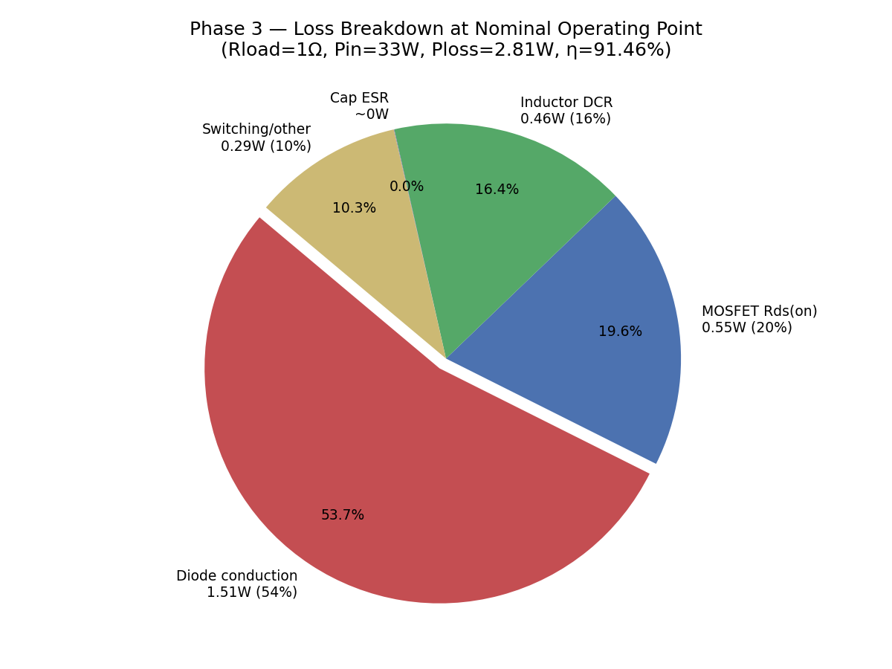

# Buck Converter — LTspice Simulation & Analysis

A complete design, simulation, and analysis of a 12V→6V synchronous buck converter (step-down switching regulator) in LTspice, using real silicon models (AO6408 MOSFET, MBR745 Schottky diode). The project covers open-loop baseline validation, design-space exploration, parasitic modeling, efficiency analysis, and closed-loop bang-bang voltage regulation — structured as a portfolio-grade analog power design study.

---

## Design Specifications

| Parameter | Value |
|---|---|
| Input Voltage Vs | 12 V |
| Target Output Voltage Va | 6 V |
| Switching Frequency fs | 25 kHz |
| Duty Cycle D | 0.5 (50%) |
| Switching Period Ts | 40 µs |
| Inductor L | 143 µH |
| Output Capacitor C | 200 µF |
| Load Resistance | 1 Ω (nominal) |
| Target IL ripple (pk-pk) | ≤ 0.8 A |
| Target Vout ripple (pk-pk) | ≤ 20 mV |

---

## Component Selection

| Component | Part | Key Specs | Reason |
|---|---|---|---|
| High-side switch | AO6408 (N-ch MOSFET) | Vds=20V, Id=8.8A, Rds(on)=18mΩ @Vgs=10V | Logic-level gate, low Rds(on) minimises conduction loss |
| Catch diode | MBR745 (Schottky) | Vr=45V, If=7.5A, Vf≈0.55V | Schottky forward voltage (~0.55V) lower than standard PN (~0.7V); no reverse recovery loss |
| Inductor | 143 µH power inductor | DCR ≈ 15 mΩ (estimated) | Derived from ripple spec — see Theoretical Design below |
| Output capacitor | 200 µF electrolytic | ESR ≈ 20 mΩ (estimated) | Derived from ripple spec |

---

## Theoretical Background

### Buck Converter Operation

A buck converter alternates between two modes each switching period:

**Mode 1 — Switch closed (duration D·Ts):**  
Current flows from Vin through the MOSFET switch and inductor to the load. The inductor stores energy and current ramps up linearly: ΔiL/Δt = (Vin − Vout)/L.

**Mode 2 — Switch open (duration (1−D)·Ts):**  
The MOSFET turns off. The inductor sustains current via the catch diode (freewheeling). Current ramps down: ΔiL/Δt = −Vout/L.

In steady-state Continuous Conduction Mode (CCM), volt-second balance on the inductor gives:

$$V_a = D \cdot V_s$$

### Design Calculations

**Duty cycle:**
$$D = \frac{V_a}{V_s} = \frac{6}{12} = 0.5$$

**Inductor — from peak-to-peak ripple spec ΔI ≤ 0.8A:**
$$L = \frac{V_s \cdot D(1-D)}{f_s \cdot \Delta I} = \frac{12 \times 0.5 \times 0.5}{25000 \times 0.8} = 150\ \mu H \implies \text{chosen } 143\ \mu H$$

**Capacitor — from ripple voltage spec ΔVc ≤ 20mV:**
$$C = \frac{V_s \cdot D(1-D)}{8 \cdot L \cdot f_s^2 \cdot \Delta V_c} = \frac{12 \times 0.25}{8 \times 143 \times 10^{-6} \times 625 \times 10^6 \times 0.02} \approx 200\ \mu F$$

**LC Natural Frequency (startup ringing):**
$$f_0 = \frac{1}{2\pi\sqrt{LC}} = \frac{1}{2\pi\sqrt{143 \times 10^{-6} \times 200 \times 10^{-6}}} \approx 941\ \text{Hz}$$

This predicts a startup envelope ringing period of 1/941 ≈ 1.06ms. Simulated peak-to-trough spacing = 0.56ms ≈ half period. Confirmed within 5%.

---

## Simulation Phases

### Phase 1 — Baseline Validation

**Objective:** Confirm the simulation setup by comparing open-loop steady-state results against textbook formulas, then explain the gap between ideal and real-component results.

The inductor current plot shows three distinct regions:
1. **0–0.4ms:** Startup ramp, inductor charging from zero
2. **0.4–1.4ms:** Startup ringing envelope (LC tank settling, f₀ ≈ 941 Hz)
3. **1.5–5ms:** Steady-state CCM triangular ripple, average ≈ 5.76A

| Metric | Theory | Sim — Ideal | Sim — Real |
|---|---|---|---|
| Avg Vout (V) | 6.000 | 5.996 | 5.765 |
| IL ripple pk-pk (A) | 0.839 | 0.844 | 0.849 |
| Vout ripple pk-pk (mV) | 20.98 | 25.20 | 26.86 |
| Efficiency (%) | 100 | 99.93 | 86.82 |

**Key observation:** The ideal-component sim tracks theory within 0.7% — confirming the simulation setup is correct before adding real components. The real-component sim drops Vout to 5.765V. The gap is explained by: MOSFET drop = Irms²·Rds(on) ≈ 0.54W, diode drop = Vf·Iavg·(1−D) ≈ 1.51W, inductor DCR ≈ 0.46W.

---

### Phase 2 — Design Space Exploration

**Objective:** Confirm theoretical scaling laws, show the inductor size vs ripple tradeoff, quantify the ESR contribution, and demonstrate open-loop line/load regulation failure.

#### 2a — Inductor Ripple vs L (L sweep, fixed fs=25kHz)

All 8 traces settle to the same average inductor current (~5.5–6A) despite wildly different ripple amplitudes. **Average IL in CCM equals Iout = Vout/Rload, independent of L.** L only controls the AC ripple magnitude, not the DC operating point.

#### 2b — Inductor Ripple vs Switching Frequency (fs sweep, fixed L=143µH)

At 10kHz the ripple period is visible and large (~2.1A pk-pk). At 200kHz the ripple is too fast to resolve visually and is tiny (~0.1A pk-pk). This is the core tradeoff in switching regulator design: **higher fs → smaller passives and less ripple, but more switching loss per cycle.**

#### 2c — ESR Ripple Contribution

At 25kHz with C=200µF, the capacitive impedance is 1/(2π·25k·200µ) = **31.8mΩ** — comparable to the 20mΩ ESR. Both terms are non-negligible. The total output ripple ≈ ΔVc (capacitive) + ΔI·ESR (resistive). The ESR component is in phase with inductor current (peaks at switching transitions), while the capacitive component peaks mid-cycle — their phase difference means they don't add directly.

#### 2d — Line and Load Regulation (Open Loop)

With fixed D=0.5, Vout follows Vin·D — stepping Vin from 9V→15V shifts Vout proportionally with no correction. Similarly, varying load resistance causes Vout to sag or rise depending on component losses. **This is the motivation for Phase 4: open-loop converters cannot maintain regulation against line or load disturbances.**

---

### Phase 3 — Efficiency and Loss Analysis

**Objective:** Quantify real-world losses and identify the dominant loss mechanism.



| Rload (Ω) | Iload (A) | Efficiency (%) |
|---|---|---|
| 0.25 | ~22 | 79.70 |
| 0.5 | ~11 | 87.11 |
| 1.0 | ~5.5 | 91.46 |
| 2.0 | ~2.75 | 93.91 |
| 5.0 | ~1.1 | 96.29 |
| 10.0 | ~0.55 | 96.34 |

**At nominal (Rload=1Ω):** Pin=33.00W, Pout=30.19W, Ploss=2.81W, η=91.46%



| Loss Source | Formula | Value | % of Total |
|---|---|---|---|
| Diode conduction | Vf × Iavg × (1−D) = 0.55×5.5×0.5 | 1.51 W | 54% |
| MOSFET Rds(on) | Irms² × 0.018 = 5.51²×0.018 | 0.55 W | 20% |
| Inductor DCR | Irms² × 0.015 = 5.51²×0.015 | 0.46 W | 16% |
| Cap ESR | Irms_cap² × 0.02 | ~0.001 W | <1% |
| Switching/other | (measured − estimated) | ~0.29 W | 10% |
| **Total estimated** | | **~2.52 W** | |
| **Total measured** | | **2.81 W** | |

**Key insight:** The Schottky diode accounts for over half of all losses. This is the fundamental motivation for **synchronous rectification** — replacing the catch diode with a second MOSFET reduces the freewheeling voltage drop from ~0.55V (Vf) to ~0.1V (Irms·Rds(on)), improving efficiency by ~4–5% at nominal load.

---

### Phase 4 — Closed-Loop Voltage Regulation

**Objective:** Implement a feedback control loop and demonstrate Vout regulation against load transients.

#### Control Architecture

```
Vout ──► Feedback Divider (R1=50kΩ, R2=10kΩ) ──► Vfb
                                                      │
Vref (1V) ──────────────────────────────────────────►├──► Error (bang-bang comparator)
                                                      │         │
                                              if Vfb < Vref: gate=12V (ON)
                                              if Vfb > Vref: gate=0V  (OFF)
```

**Feedback divider:** R1=50kΩ, R2=10kΩ scales Vout=6V down to Vfb=1V (= Vref) at the target operating point. Ratio: R2/(R1+R2) = 10k/60k = 1/6.

**Controller type — Bang-bang (hysteretic):** The gate drive compares Vfb directly against Vref with no PWM carrier: `Gate = if(Vfb < Vref, 12V, 0V)`. This is a valid closed-loop topology but has no integrator, so a small steady-state error persists (~0.1–0.15V on Vfb). A Type II compensator with an integrator would eliminate this error completely.

#### Closed-Loop Transient Response

| Event | Value |
|---|---|
| Steady-state Vout (regulated) | ~5.9 V |
| Load step at t=2ms (1Ω → 0.5Ω, doubled current) | Vout dips to ~4.8V |
| Recovery time after load step dip | ~0.8 ms |
| Load removal at t=3ms (0.5Ω → 1Ω) | Vout spikes to ~7.2V |
| Recovery time after load removal spike | ~0.7 ms |
| Steady-state Vfb vs Vref | 0.85V vs 1V (steady-state error = 0.15V) |

**Comparison to open-loop (Phase 2d):** In open-loop, Vout shifts permanently with load changes and never returns to the target. In closed-loop, Vout recovers to the regulated value every time — demonstrating the core value of feedback control.

---

## Results Summary

| Phase | Key Result |
|---|---|
| Phase 1 | Ideal-sim matches theory within 0.7%. Real-component Vout = 5.765V (gap explained by Vf + Rds(on) + DCR) |
| Phase 2a | IL ripple scales as 1/L — confirmed across 50µH to 600µH |
| Phase 2b | IL ripple scales as 1/fs — confirmed across 10kHz to 200kHz |
| Phase 2c | ESR ripple comparable to capacitive ripple at 25kHz (Zcap=31.8mΩ ≈ ESR=20mΩ) |
| Phase 2d | Open-loop: Vout unregulated, tracks Vin and load changes directly |
| Phase 3 | η=91.46% nominal. Diode = 54% of losses. Peak efficiency 96.3% at light load |
| Phase 4 | Closed-loop: Vout regulated at ~5.9V. Recovers from load steps within ~0.8ms |

---

## Tools Used

- **LTspice XVII** — schematic capture and SPICE simulation
- **Python 3 / NumPy / Matplotlib** — post-processing graphs
- **AO6408 MOSFET model** — Alpha & Omega Semiconductor (loaded from LTspice library)
- **MBR745 Schottky model** — ON Semiconductor (loaded from LTspice library)
